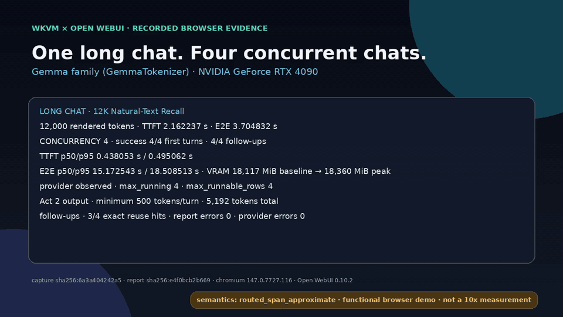
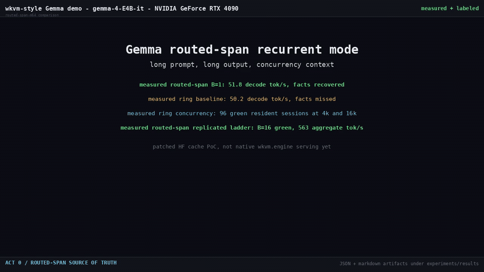

# wkvm

**A hypervisor for model state.** State-native inference for RWKV-7, GDN,
Mamba2, and hybrid-linear models, where the primary allocation object is a
fixed-size per-request **state slot**, not a paged KV block chain.

> WKV + KVM: states are the VMs—create, snapshot, fork, hibernate, resume, and
> live-migrate them. The engine is the hypervisor.

## Open WebUI quick start

This is the shortest path to a local browser chat backed by WKVM's Gemma
routed-span guest mode. It is a **compatibility demo**, not a same-semantics
replacement for full-KV Gemma serving: routed-span keeps a bounded approximate
memory, and the current chat API is a text-only greedy subset.

The tested target is Linux, an NVIDIA GPU with 24 GB VRAM, Python 3.12, and
roughly 40 GB of free disk for the checkpoint, environments, and caches. Read
the [complete installation and troubleshooting guide](docs/OPEN_WEBUI_DEMO.md)
before adapting it to another machine.

```bash
# Install isolated WKVM and Open WebUI 0.10.2 environments.
./scripts/open_webui_demo.sh install

# Accept google/gemma-4-E4B-it on Hugging Face, then authenticate and download.
hf auth login
hf download google/gemma-4-E4B-it \
  --local-dir "$HOME/models/gemma-4-E4B-it"

# Check the machine, start both loopback services, and verify a real chat.
WKVM_MODEL_DIR="$HOME/models/gemma-4-E4B-it" \
  ./scripts/open_webui_demo.sh doctor
WKVM_MODEL_DIR="$HOME/models/gemma-4-E4B-it" \
  ./scripts/open_webui_demo.sh start
./scripts/open_webui_demo.sh smoke
```

Open <http://127.0.0.1:3000>, create the first local account, and select
`wkvm-gemma-4-e4b-it`. Stop both services with
`./scripts/open_webui_demo.sh stop`. A pinned Docker Compose alternative is in
[`deploy/open-webui/compose.yaml`](deploy/open-webui/compose.yaml); it uses
Linux host networking because the WKVM CLI binds to `127.0.0.1`.

The helper starts WKVM with `--enable-openai-chat`, four conservative state
slots, normal EOS handling, and the checkpoint-native production profile. It
pins greedy UI defaults, disables unsupported background/tool features, and
does **not** reuse the high-memory B32 benchmark recipe or `--ignore-eos`.

### Current chat contract

- Blocking and streaming `/v1/chat/completions`, `/v1/models`, `/health`, and
  `/metrics` are available.
- Requests must use text messages, `temperature=0`, `top_p=1`, and `n=1`;
  tools, images, logprobs, and custom stop sequences are not supported.
- The helper configures Open WebUI's `parent-token-v1` provider headers. WKVM
  binds each parked state to the model, user, chat, current assistant message,
  previous assistant parent, exact visible history, and an internal raw-token
  digest. Edits, branches, stale parents, or missing metadata restart safely.
- `parent-token-v1` is an explicit stateful contract: WKVM preserves the exact
  provider-generated token history, including hidden or noncanonical tokens,
  instead of pretending that a decode-to-text-to-token round trip is identical.
- WKVM mirrors Open WebUI 0.10.2's persisted outer-whitespace normalization,
  and the helper disables reasoning-tag extraction. Content-changing filters
  or edits fail the visible-history check and safely start a fresh state.
- Both services bind to loopback. WKVM currently has no API-key enforcement,
  so do not expose port 8000 to a LAN or the Internet.
- This UI path exercises approximate Gemma routed-span mode. WKVM's native
  RWKV-7 durable-state engine and API are separate paths.

## Open WebUI live demo

[](experiments/results/open_webui_live_demo_20260717.mp4)

**On one RTX 4090, four real concurrent Open WebUI chats completed and
validated their classic-prompt first turns and follow-ups (4/4 each). Every
Act 2 response produced at least 500 tokenizer-counted output tokens (5,192
total), with first-turn browser p95 TTFT of 0.495 s, p95 E2E of 18.509 s,
whole-GPU memory moving from 18,117 to 18,360 MiB, and zero provider, capture,
probe, or validation errors.**

The long-context recall lane now uses natural prose rather than repeated
filler: a contiguous excerpt of Lewis Carroll's *Alice's Adventures in
Wonderland* from the Hugging Face dataset `common-pile/project_gutenberg`,
document `11`, whose row metadata declares `Public Domain`. The prompt contained
exactly 12,000 rendered tokens, with its needle beginning at zero-based rendered
token index 253. It correctly returned `BLUE-742`, `Samarkand`, and `lantern`,
at a browser-observed TTFT of 2.162 s and E2E of 3.705 s.

The source is pinned to dataset revision
`01dc90a5002f8977c7fb03a372c14bca29c65cf1`, converted-Parquet revision
`d0bf09a2c2f6f73952733d7a1fe9a34b1cb4348c`, and document-text SHA-256
`f17aa0bf7466424a8b357b688678666bad7a0148963ef349016a3098faa6bd1e`.
Fetch and verify it with `scripts/fetch_open_webui_demo_source.sh`; the helper
uses `hf datasets sql` and requires the Hugging Face CLI's DuckDB support.

Provider telemetry sampled after the four-chat high-water point reported
`max_running=4` and `max_runnable_rows=4`; 3/4 follow-ups were exact state-reuse
hits, one safely restarted from the full rendered prompt, and 2,605 prefix
tokens were reused. All nine scored browser turns completed without a provider
error, cancellation, or timeout.

This is a graph-free, corrected production-profile run using
`routed_span_approximate`: a functional four-slot browser demo, not a
controlled load test and **not a 10x Open WebUI measurement**. It demonstrates
this prompt set and serving path; it does not establish quality equivalence or
a universal engine ranking. See the [full report](experiments/results/open_webui_classic_prompts_20260717.md),
[raw result JSON](experiments/results/open_webui_classic_prompts_20260717.json),
or [full-quality MP4](experiments/results/open_webui_live_demo_20260717.mp4).
The separately scoped provider-HTTP comparison follows.

## Performance evidence

There is no honest workload-independent “WKVM is 10x faster” claim. The
current evidence supports scoped workload-specific speedups and also contains
workloads where vLLM remains faster. A later exact-trace vLLM optimization
audit superseded the earlier RTX 4090 10x-vLLM result.

> **Current Open WebUI checkpoint:** The strict 2026-07-23 B32 x 8 run passed
> all 256 requests and reused all 224 eligible continuations with 32 sessions
> opened, zero closed, and zero parent-history rejections. R5 completed in
> 94.953s at 345.097 output tok/s, measuring 2.153x the tested vLLM mode-0
> profile and 5.305x the tested SGLang profile. It is one controlled cross-run
> comparison on an active RTX 4090 desktop; repeated rotated runs are still
> required before treating the ratios as a publication-grade envelope.

> **A800 status:** A single exploratory B32, 98,304-token, 12-turn scout
> measured 12.107x versus vLLM (346.300 s versus 4,192.690 s), but it is not a
> publication-grade 10x claim yet. It used a dirty worktree, did not freeze the
> final incumbent optimization profiles, and has no matching SGLang T12 result.
> The claim remains pending a clean, repeated campaign on homogeneous A800s.

| measured workload | WKVM result | vs vLLM | vs SGLang | outcome |
|---|---:|---:|---:|---|
| Real Open WebUI 0.10.2, B32, 8 turns, 13,824-token initial context | **94.953s / 345.097 output tok/s** | **2.153x throughput** | **5.305x throughput** | strict 224/224 reuse pass; repeats pending |
| RTX 4090 provider HTTP, B16, 48 turns, 36,864-token initial context | 180.415s complete wall | **9.827x throughput** against later mode-3 audit | **26.079x throughput** against original SGLang row | original 10x-vLLM conclusion superseded |
| **PROVISIONAL:** A800 provider HTTP scout, B32, 12 turns, 98,304-token initial context | 346.300s complete wall | **12.107x throughput** | not matched | clean repeated campaign pending |
| **OUTDATED:** Real Open WebUI 0.10.2, offered B32, 8 turns | 53.963 output tok/s | 0.586x; vLLM is 70.6% faster | 0.998x; effectively tied | historical only; rerun required |
| Repeated A800 strict short-session gate, B64/ctx16K/out32 | worst-repeat envelope | 0.790x | 1.400x | overall gate fail |

The original B16 x 48-turn cohort completed all 2,304 requests from a
36,864-token initial context: WKVM took 180.415s, the original vLLM mode-0 row
took 2,011.890s, and SGLang took 4,705.123s. A later clean vLLM mode-3 run
replayed the identical trace in 1,772.936s, reducing the cross-run WKVM/vLLM
ratio to **9.827x**. Therefore the repository no longer makes a 10x-vLLM claim
from this artifact. The comparison remains exploratory and uses WKVM
`routed_span_approximate` versus incumbent `full_kv` semantics; it does not
establish a universal ranking or quality equivalence.

The current strict Open WebUI row completed 256/256 requests in 94.953s and
generated 345.097 output tok/s. The tested vLLM mode-0 profile completed the
matching workload in 204.388s at 160.322 tok/s; the tested SGLang profile took
503.700s at 65.055 tok/s. WKVM reused 17 exact token prefixes plus 207
parent-bound deltas, with zero restarts. Continuation-only throughput was
458.090 tok/s, 2.818x vLLM and 7.072x SGLang. R5 removed the B32 execution
bottleneck: decode reached 32 rows with zero microbatch splits. This still is
not a 10x Open WebUI result because turn 0 alone took 32.363s, above the entire
20.439s 10x wall budget.

The regular helper remains the conservative four-slot interactive profile. To
start the measured high-memory recipe for controlled B32 testing, stop any
managed interactive services first, then use
`WKVM_DEMO_PROFILE=benchmark-b32 ./scripts/open_webui_demo.sh start`. It enables
`--ignore-eos`, sets the Open WebUI default output limit to 128 tokens, and is
not intended for normal chat. The benchmark driver explicitly requests that
same 128-token limit for every measured request.

Evidence and methodology:

- [48-turn RTX 4090 E2E report](experiments/results/gemma_4090_48turn_10x_20260717.md)
- [Current strict Open WebUI B32 x 8 report](experiments/results/open_webui_parent_token_b32_t8_20260723.md)
- [A800 10x methodology and pending gate](docs/10X_E2E_PLAN.md)
- [Outdated historical Open WebUI B32 x 8 report](experiments/results/open_webui_b32_t8_compare_20260714.md)
- [Repeated A800 comparison](experiments/results/gemma_a800_reliable_20260716/report.md)
- [Controlled B16 evidence audit](experiments/results/gemma_b16_evidence_audit_20260713.md)
- [10x E2E scope and optimization plan](docs/10X_E2E_PLAN.md)

## Routed-span demo

[](experiments/results/gemma_routed_span_demo.mp4)

Full-quality video:
[`experiments/results/gemma_routed_span_demo.mp4`](experiments/results/gemma_routed_span_demo.mp4)

## Serving API

`wkvm.gemma_server` exposes token-ID completion, streaming, submit/status,
cancellation, health, metrics, and model-discovery routes.
`/v1/chat/completions` is deliberately opt-in because enabling it loads the
tokenizer. `python -m wkvm.gemma_server` is equivalent to the
`wkvm-gemma-server` entry point.

```bash
python -m pip install -e '.[gemma-server]'

wkvm-gemma-server \
  --model /path/to/gemma-4-E4B-it \
  --served-model-name wkvm-gemma-4-e4b-it \
  --enable-openai-chat \
  --native-gemma-production-profile \
  --slots 4 --max-chat-sessions 4 --max-queue 16 \
  --request-timeout-s 600 --port 8000
```

`--ignore-eos`, forced output length, cache-emptying, and fixed B32 pool/graph
settings are benchmark controls, not normal serving defaults. For exact launch
provenance and comparison commands, use the linked result reports rather than
copying a historical benchmark profile into production.

## Why

For linear and hybrid models, per-request memory is **constant and tiny**. An
RWKV-7 7B state is roughly 20 MB—about 1000x smaller than long-context KV.
Building around that physics gives the engine:

- **Exact admission**—scheduling is counting free slots, with no fragmentation
  or watermark math.
- **Uniform decode batches**—whole-step CUDA graphs and high throughput scaling.
- **Sessions as objects**—hibernate/resume in one transfer, fork in one slot
  copy, and migrate in one RDMA write.
- **The Durable State API**—named, versioned, forkable, exportable, and mutable
  state handles (`/v1/states`). Mutable state is a capability prefix-keyed KV
  caches cannot represent.

Full-attention layers in hybrid models run in a deliberately simple paged
**guest pool**. Pure transformers are supported as guests for parity and, in
Gemma routed-span mode, with bounded approximate memory. See
[`docs/RECURRENT_MODE.md`](docs/RECURRENT_MODE.md).

## Documentation

- [`docs/OPEN_WEBUI_DEMO.md`](docs/OPEN_WEBUI_DEMO.md)—user install, first chat,
  verification, security, and troubleshooting.
- [`docs/ANGLE.md`](docs/ANGLE.md)—vLLM/SGLang architecture audit and design
  choices.
- [`docs/COMPARISON.md`](docs/COMPARISON.md)—engine comparison and historical
  measurements.
- [`docs/RECURRENT_MODE.md`](docs/RECURRENT_MODE.md)—bounded transformer
  recurrent-mode design.
- [`docs/NATIVE_ENGINE_PLAN.md`](docs/NATIVE_ENGINE_PLAN.md)—native engine plan.
- [`ROADMAP.md`](ROADMAP.md)—milestones.

## Status

**M3—Durable State API:** named, versioned, forkable, mutable state handles over
a tiered StateStore (GPU slot, pinned host, and NVMe safetensors). Measured demos
include 2,000 hibernated sessions at 2.29 MiB each, p50 8.2 ms / p99 9.5 ms
resume, process-restart recovery, 64-way fork, and provenance-recorded mutation.

**M2—native RWKV-7 serving:** a no-phases scheduler drives FLA-kernel decode
from arena state slots with continuous batching and per-batch-bucket CUDA
graphs. A 1.5B model measured 8.1k tok/s at B256 on an RTX 4090.

## Development

The base package is dependency-free so scheduler and arena invariants remain
CPU-testable.

```bash
python -m unittest discover -s tests -v
```

```text
wkvm/core/config.py     typed state families, slot layouts, and engine limits
wkvm/core/request.py    request lifecycle and computed-token invariant
wkvm/core/arena.py      per-family state-slot allocation and exact admission
wkvm/core/scheduler.py  no-phases continuous-batching scheduler
tests/                  CPU-first invariant and integration tests
```

## License

Apache-2.0 (LICENSE file pending).
